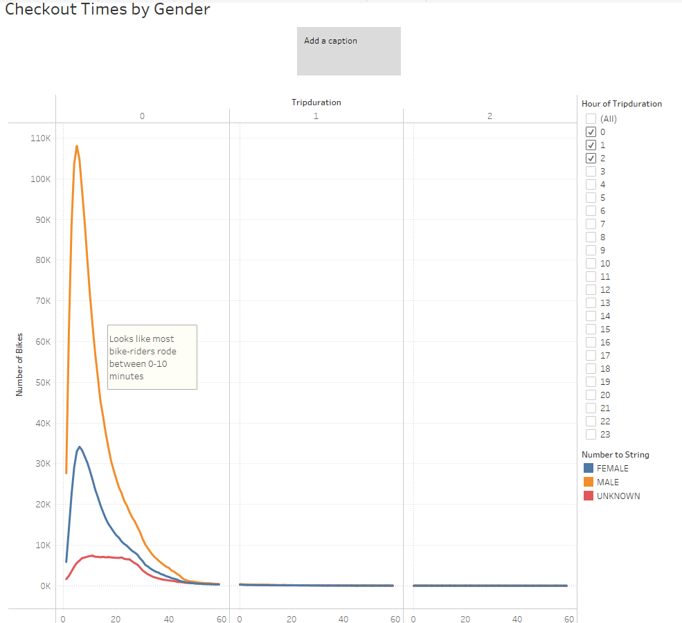
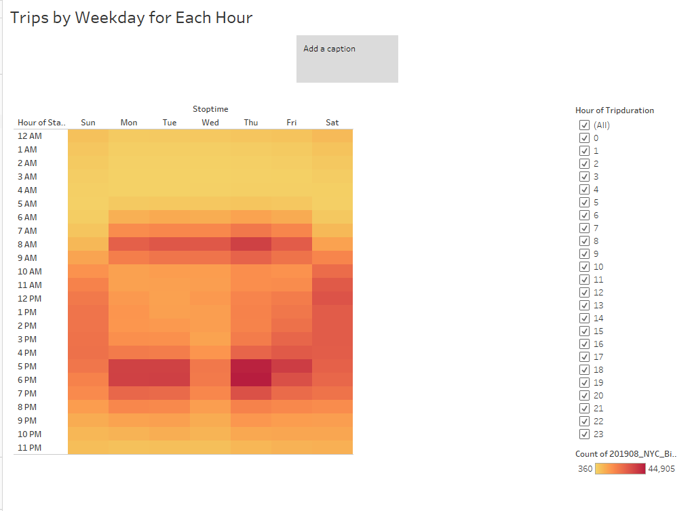
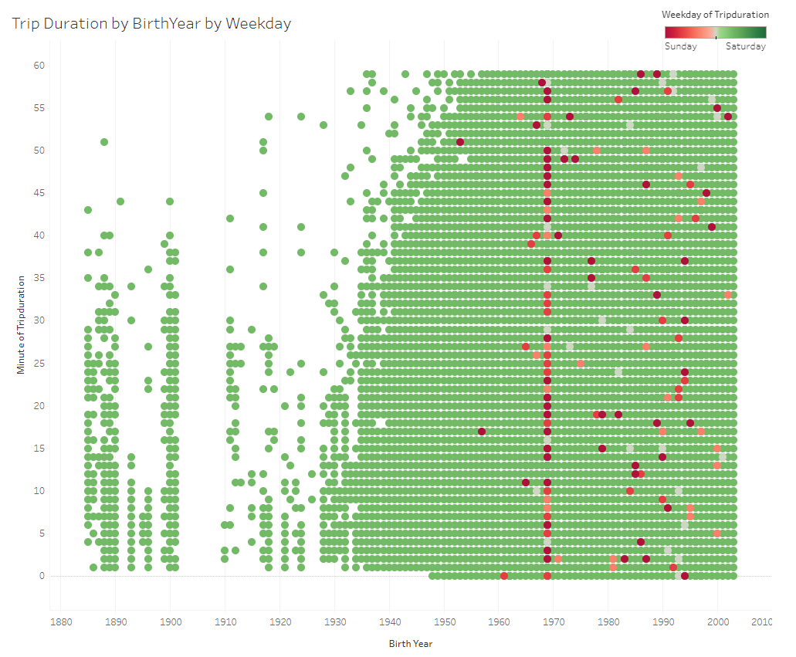
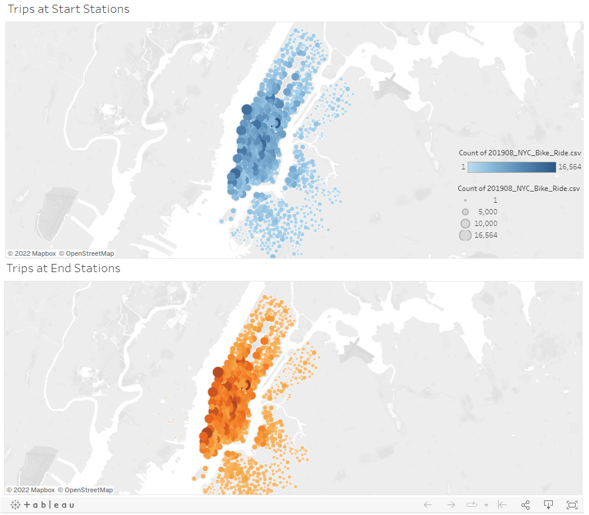

# Bike Sharing
Tableau Visualization Analysis!

## Overview of the analysis
This analysis has been conducted to show our investors that this bike-sharing program in Des Moines is a solid business proposal. 

## Results

### Checkout Times by Gender
##### This is showing Trip Duration by Hour by Gender.
- We can definitely see that there were most bike-riders of 0-10 minute trip duration. 
- The number of Male riders even went almost up to 110K. 

  - Link to the story - https://public.tableau.com/app/profile/kimberly.kang/viz/Story2_CheckoutTimesbyGender/Story2?publish=yes

### Trips by Weekday for Each Hour
##### This visualizaion is showing how many trips by each hour 
- More red areas tell us that there were more rides around 7-9AM and 5-7PM on the weekdays, 
   which can tell us people are using bike sharing to commute to their work
- There was also a good amount of trips on the weekends 

  - Link to the story - https://public.tableau.com/app/profile/kimberly.kang/viz/Story3_TripsbyWeekdayforEachHour/Story3?publish=yes

### Trip Duration by Birth Year by Weekday
##### This visualization is telling us that people who were born later than 1940s use the bike riding a lot and the trip duration is spreadout between 0-60 minutes throughout the week.

  - Link to the dashboard - https://public.tableau.com/app/profile/kimberly.kang/viz/Dashboard2-TripDurationbyBirthYearbyWeekday/Dashboard2

### Trips at Start Stations Vs. End Stations
##### It doesn't show that much of difference between them but we can tell that in the city at both start stations and end stations, the rides are packed.

  - Link to the dashboard - https://public.tableau.com/app/profile/kimberly.kang/viz/Dashboard1-TripsatStartEndstations/Dashboard1

## Summary
